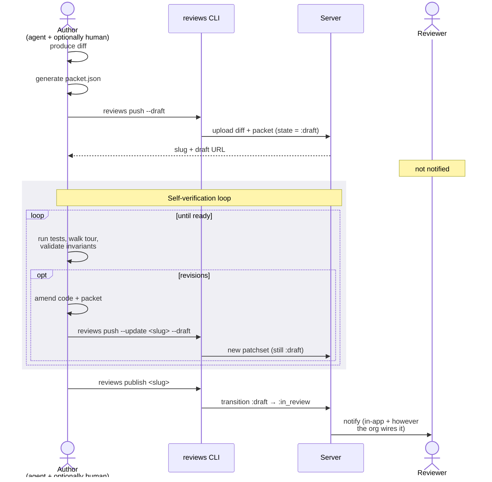
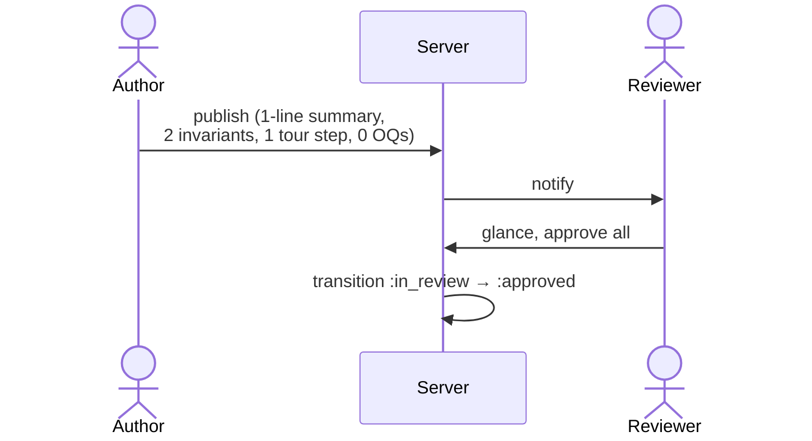
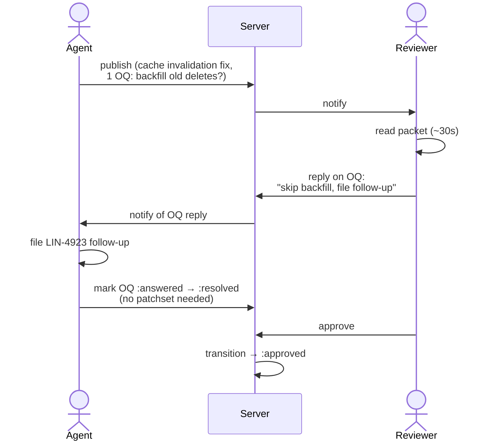
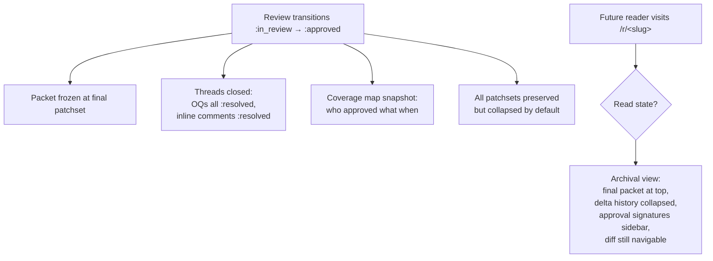

# PRD — Review Packet Lifecycle

Companion to [`./review-packet-rfc.md`](./review-packet-rfc.md) and [`./review-packet-spec.md`](./review-packet-spec.md). Holds the user stories cut from the RFC and walks through the lifecycle transitions — **Draft → In Review → Approved** — with detailed flows for each.

---

## Personas

| Persona | Role |
| --- | --- |
| **Author** | Agent, human, or agent+human pair that produces the diff and packet. Owns the change until it's published. |
| **Reviewer** | One or more humans who sign off. May be primary (owns the merge decision) or supplementary (sign off on a specific step or check). |
| **Future reader** | Anyone who lands on the URL after approval — auditor, on-call investigating a regression, new hire onboarding. |

## Lifecycle at a glance

```mermaid
stateDiagram-v2
    [*] --> Draft: reviews push --draft
    Draft --> Draft: reviews push --update --draft<br/>(author iteration)
    Draft --> InReview: reviews publish
    InReview --> InReview: reviews push --update<br/>(patchset N+1)
    InReview --> Draft: reviews unpublish<br/>(author pulled back)
    InReview --> Approved: all required sign-offs
    Approved --> InReview: reviews reopen<br/>(rare; post-approval correction)
    Approved --> [*]
```

| State | Who can see it | Notifications | Mutable? |
| --- | --- | --- | --- |
| **Draft** | Author(s) only | None | Yes — author iterates freely |
| **In Review** | Author + invited reviewers (or public via link, per existing model) | Reviewers notified on publish + each new patchset | Author pushes patchsets; reviewers add state |
| **Approved** | Anyone with the link | None | Frozen; threads and coverage are archival |

`Approved` is a terminal review-lifecycle state. The review tool doesn't manage merges — what the author does with the branch afterward is their business. "Approved" means *the reviewer has signed off on this packet*; deployment is downstream.

---

## Draft — author preparation

### Story: Agent self-verification before handoff

The agent finishes coding a feature, generates the packet, and wants to walk through its own work before pinging a human. Goals:

- Run anything the agent can run automatically (tests, lint, type check) and update the packet's testing checks to reflect what's already passed.
- Validate invariants against the actual diff (evidence pointers resolve, claims aren't trivially contradicted by the code).
- Catch packet-level errors (orphaned hunks, broken refs, tour steps with no hunks).
- Optionally let the *human* who invoked the agent glance at the packet before reviewers are notified.



**Notable:** the draft state explicitly supports the agent pushing multiple patchsets before publishing. The reviewer doesn't see five draft patchsets — they see whatever the agent finally publishes. Patchset history is preserved server-side regardless (useful for postmortem of the agent's process), just not surfaced in the default review view.

---

## In Review — rounds of feedback

Three stories, increasing in complexity. Each illustrates a different valued behavior of the packet.

### Story A — Trivial: typo fix

Zero feedback rounds. The packet is so small the loop barely exists.



Total reviewer time: under a minute. **The packet structure doesn't get in the way of trivial changes.** That's the test — if reviewers learn to ignore small packets, the structure is wrong.

### Story B — Scoped bug fix with a judgment call

The fix is mechanical. The *open question* is where the human's time concentrates. No new patchset gets pushed.



**Notable:** the in-review loop runs without a patchset bump. Open questions aren't always coupled to code changes — sometimes the resolution is a decision, a follow-up ticket, or a confirmation. The packet model has to support that.

### Story C — Simple feature with iteration

The patchset-update flow + the update delta carries this story.

```mermaid
sequenceDiagram
    actor Author as Agent
    participant Server
    actor Reviewer

    Author->>Server: publish v1 (CSV export,<br/>4 steps, 2 OQs:<br/>filename + row cap)
    Server->>Reviewer: notify

    Reviewer->>Server: tick checks, approve steps 1+3
    Reviewer->>Server: reply OQ#1 ("keep yours")
    Reviewer->>Server: reply OQ#2 ("hard cap at 1M")
    Reviewer->>Server: inline comment on step 2

    Server->>Author: notify of replies + comment

    Author->>Author: address comment,<br/>implement row cap,<br/>update packet
    Author->>Server: reviews push --update (v2)

    Server->>Server: anchor rehydration:<br/>steps 1, 3, 4 carry approvals<br/>step 2 hunks modified → re-verify
    Server->>Server: compute update delta:<br/>1 OQ resolved, 1 OQ addressed,<br/>1 inline thread addressed,<br/>1 new invariant (row cap)
    Server->>Reviewer: notify; delta banner

    Reviewer->>Reviewer: read delta only (~20s)
    Reviewer->>Server: re-verify step 2,<br/>approve step 5 (new)
    Reviewer->>Server: approve review

    Server->>Server: transition → :approved
```

**Notable:**

- Approvals on unchanged steps survived the patchset update — the reviewer didn't have to re-approve the whole thing.
- The delta banner is the load-bearing UX. Without it, the reviewer reads v2 cold and burns the time savings.
- The "needs re-verification" affordance on step 2 directs attention precisely to the hunks that changed.

---

## Approved — historical / archival view

Once approved, the review's job changes from *driving a decision* to *preserving institutional memory*. The packet stops being interactive and starts being a document.



### Story D — Future reader / onboarding

A new hire is trying to understand why a system behaves a certain way. They git-blame to a commit, the commit references a `/r/<slug>` URL. They land on the approved review.

What they see:

- **Summary + invariants first.** They learn what the change claimed to do and what it claimed to preserve.
- **Tour.** Walks them through the diff in narrative order — far easier to understand than the raw diff.
- **Open questions, all resolved.** Reads as a Q&A about why specific decisions were made. *This is the highest-value section for historical readers* — it captures the alternative paths considered and rejected.
- **Testing block + coverage map.** Shows what was verified, by whom, including the reviewer's notes if any.

The future reader doesn't need a different page — the same review URL serves both live and archival audiences. The UI just shifts mode based on state.

### Story E — Audit traceback

A bug surfaces in production. On-call traces it back through approved reviews to find the suspect change.

```mermaid
flowchart LR
    Bug[Bug in prod] --> Git[git log + blame]
    Git --> Slug[Approved review URL]
    Slug --> Packet[Approved packet]
    Packet --> Inv[Invariants block:<br/>"did we claim<br/>this was protected?"]
    Packet --> Test[Testing block:<br/>"what was verified?"]
    Packet --> OQ[Resolved OQs:<br/>"did anyone raise this?"]
    Inv --> Verdict{Verdict}
    Test --> Verdict
    OQ --> Verdict
    Verdict --> Postmortem
```

The packet becomes evidence in a postmortem: claimed invariants vs. actual behavior, manual checks performed vs. the bug's actual repro, OQs that hint someone considered the risk vs. ones that show nobody did. **The packet's value compounds over time** — at review-time it directs attention; in audit, it's the receipt.

---

## Cross-state edge cases

| Transition | Trigger | Behavior |
| --- | --- | --- |
| `In Review → Draft` | `reviews unpublish` | Author pulls the review back; reviewers notified once. Prior reviewer state preserved but hidden. Re-publishing restores state. |
| `Approved → In Review` | `reviews reopen` | Rare. Used post-approval if a critical issue surfaces before merge. Approval signatures preserved but marked stale until re-confirmed. |
| Multi-reviewer in progress | n/a | Approvals accumulate per reviewer. Transition to `:approved` requires all *required* reviewers to have signed off — others are advisory. Required vs. advisory is configured per review or per `required_role` check. |
| Author pushes new patchset after approval | `reviews push --update` on approved review | Rejected by default; author must `reviews reopen` first. Prevents silent post-approval drift. |

---

## Open PRD questions

1. **Who's "required" vs. "advisory" by default?** Most lightweight: the first invited reviewer is required, additions are advisory until explicitly upgraded. Worth deciding before MVP because it affects the `:approved` transition.
2. **Notification mechanism in scope for MVP?** "Notify reviewer on publish" implies a channel — in-app only, email, Slack, webhook? The lifecycle works regardless, but the *experience* of being a reviewer depends on this.
3. **What does "publish" surface to the reviewer?** Just the URL, or a digest of the packet? Worth a small design pass — the publish notification is the first contact with the packet for the reviewer.
4. **Should draft state be visible to *invited* reviewers (read-only) or strictly private?** Some authors will want to share a draft for early feedback without formally publishing. Could be a `--share-draft` flag. Defer to post-MVP unless there's a strong pull.
5. **Reopen semantics for approval signatures.** When a review is reopened post-approval, do prior approvals carry as advisory until re-confirmed, or are they wiped? Leaning carry-as-stale, but worth confirming.
