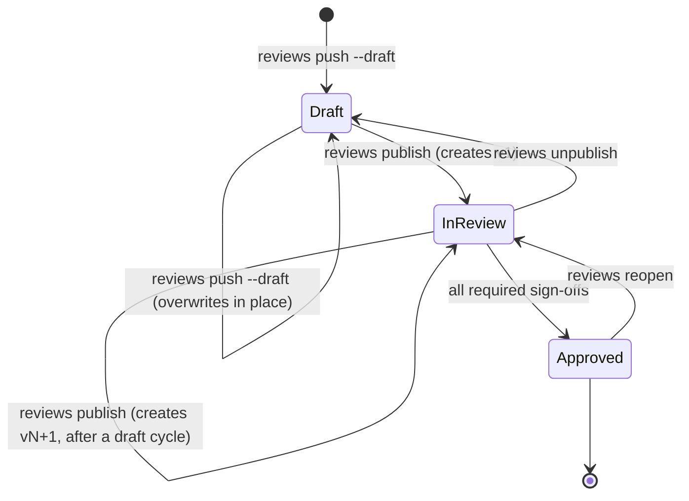
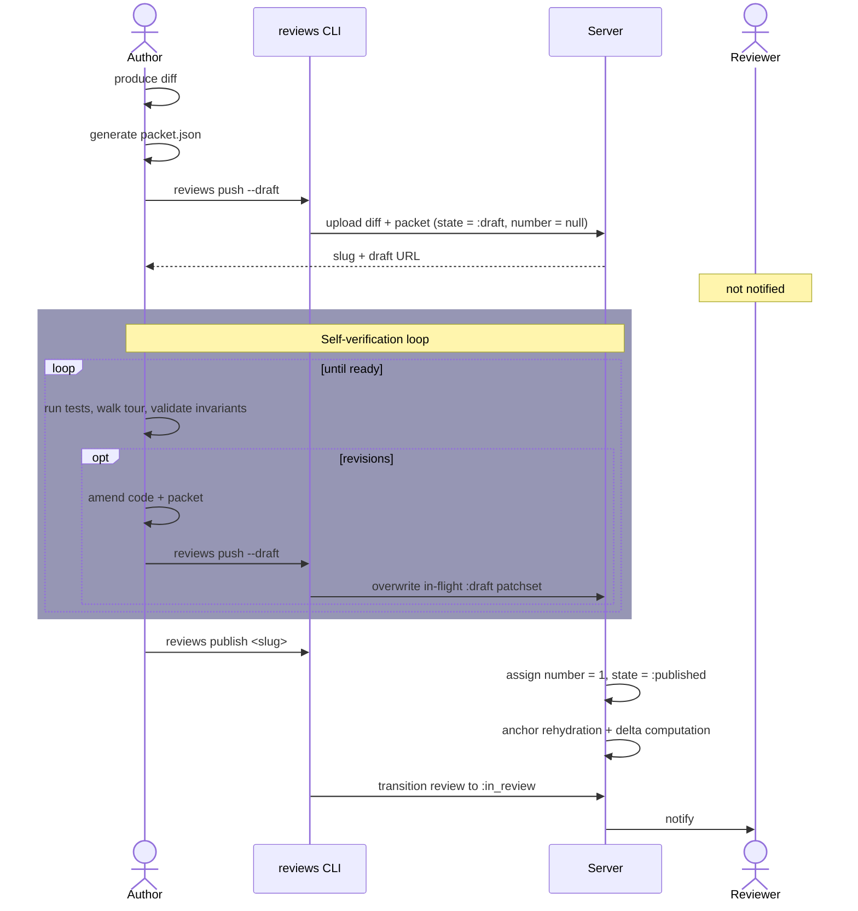
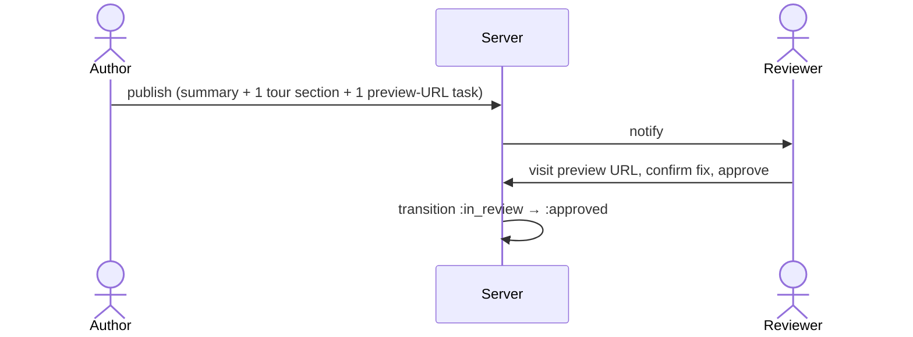
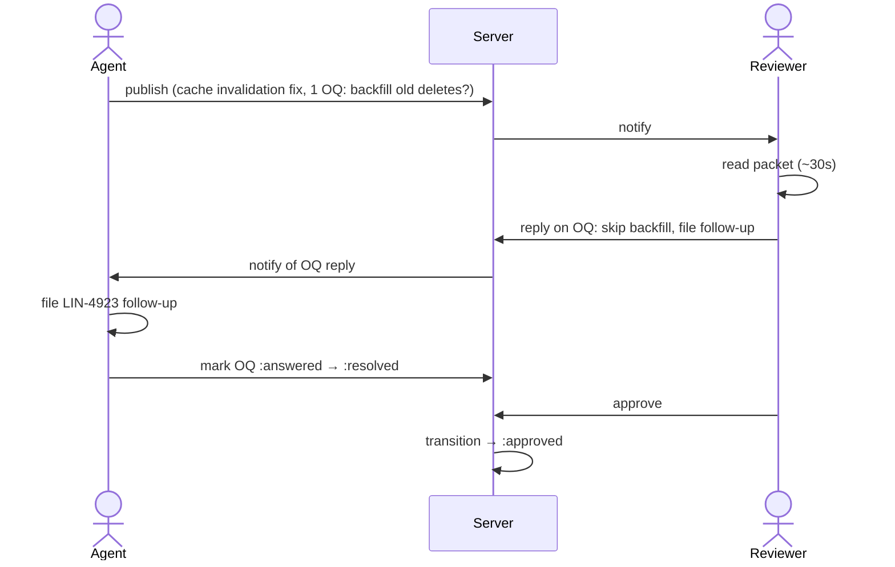
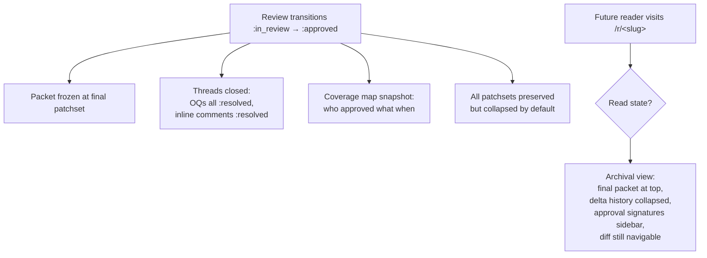

# PRD: review packet lifecycle

Companion to [`./review-packet-rfc.md`](./review-packet-rfc.md) and [`./review-packet-spec.md`](./review-packet-spec.md). Holds the user stories cut from the RFC and walks through the **Draft → In Review → Approved** lifecycle transitions with detailed flows for each.

---

## Personas

| Persona | Role |
| --- | --- |
| **Author** | Agent, human, or agent+human pair that produces the diff and packet. Owns the change until it's published. |
| **Reviewer** | One or more humans who sign off. May be primary (owns the merge decision) or supplementary (sign off on a specific tour section or testing task). |
| **Future reader** | Anyone who lands on the URL after approval (auditor, on-call investigating a regression, new hire onboarding). |

## Lifecycle at a glance



| State | Who can see it | Notifications | Mutable? |
| --- | --- | --- | --- |
| **Draft** | Author(s) only | None | Yes. Each draft push overwrites the in-flight patchset; intra-draft churn is not preserved as separate revisions |
| **In Review** | Author + invited reviewers (or public via link, per existing model) | Reviewers notified on each *publish* event | Author can push new drafts that supersede the current one; only `reviews publish` produces a new visible patchset |
| **Approved** | Anyone with the link | None | Frozen; threads and coverage are archival |

`Approved` is a terminal review-lifecycle state. The review tool doesn't manage merges; what the author does with the branch afterward is their business. "Approved" means *the reviewer has signed off on this packet*; deployment is downstream.

---

## Draft: author preparation

### Story: Agent self-verification before handoff

The agent finishes coding a feature, generates the packet, and wants to walk through its own work before pinging a human. Goals:

- Run anything the agent can run automatically (tests, lint, type check) and update the packet's testing tasks to reflect what's already passed.
- Validate invariants against the actual diff (evidence pointers resolve, claims aren't trivially contradicted by the code).
- Catch packet-level errors (orphaned hunks, tour sections with no hunks, unresolved inline references).
- Optionally let the *human* who invoked the agent glance at the packet before reviewers are notified.



Draft pushes overwrite the in-flight patchset in place; they don't accumulate as separate revisions. The reviewer eventually sees a clean v1, v2, v3 sequence corresponding 1-to-1 with publish events. Intra-draft churn is invisible in the review view. Anchoring and delta computation only fire on publish, so the cost of draft iteration is just an upload (no rehydration). MVP doesn't preserve intra-draft snapshots; if "agent process telemetry" turns out useful for postmortem later, a side table can be added without affecting the user-facing model.

---

## In Review: rounds of feedback

Three stories, increasing in complexity. Each illustrates a different valued behavior of the packet.

### Story A: typo fix

Zero feedback rounds. The packet collapses to almost nothing: summary, a single tour section wrapping the one-line hunk, optionally one testing task pointing at the preview URL. Invariants, deploy, and open questions are all empty and suppress from the render.



Total reviewer time: under a minute. The whole packet renders as a header, one diff hunk, and a single "verify on preview" checkbox. The packet structure doesn't get in the way of trivial changes. That's the test. If reviewers learn to ignore small packets, the structure is wrong.

### Story B: scoped bug fix with a judgment call

The fix is mechanical. The *open question* is where the human's time concentrates. No new patchset gets pushed.



The in-review loop runs without a patchset bump. Open questions aren't always coupled to code changes; sometimes the resolution is a decision, a follow-up ticket, or a confirmation. The packet model has to support that.

### Story C: simple feature with iteration

This story exercises the patchset-update flow and the update delta together.

```mermaid
sequenceDiagram
    actor Author as Agent
    participant Server
    actor Reviewer

    Author->>Server: publish v1 (CSV export, 4 steps, 2 OQs: filename + row cap)
    Server->>Reviewer: notify

    Reviewer->>Server: tick tasks, approve sections 1+3
    Reviewer->>Server: reply OQ#1 (keep yours)
    Reviewer->>Server: reply OQ#2 (hard cap at 1M)
    Reviewer->>Server: inline comment on section 2

    Server->>Author: notify of replies + comment

    Author->>Author: address comment, implement row cap, update packet
    Author->>Server: reviews push --draft + reviews publish (v2)

    Server->>Server: anchor rehydration, section 2 hunks need re-verify
    Server->>Server: compute update delta
    Server->>Reviewer: notify; delta banner

    Reviewer->>Reviewer: read delta only (~20s)
    Reviewer->>Server: re-verify section 2, approve section 5
    Reviewer->>Server: approve review

    Server->>Server: transition → :approved
```

What this story exercises:

- Approvals on unchanged sections survived the patchset update; the reviewer didn't have to re-approve the whole thing.
- The delta banner is the load-bearing UX. Without it, the reviewer reads v2 cold and burns the time savings.
- The "needs re-verification" affordance on section 2 directs attention precisely to the hunks that changed.

---

## Approved: historical / archival view

Once approved, the review's job changes from *driving a decision* to *preserving institutional memory*. The packet stops being interactive and starts being a document.



### Story D: future reader / onboarding

A new hire is trying to understand why a system behaves a certain way. They git-blame to a commit, the commit references a `/r/<slug>` URL. They land on the approved review.

What they see:

- **Summary + invariants first.** They learn what the change claimed to do and what it claimed to preserve.
- **Tour.** Walks them through the diff in narrative order, which is much easier than reading the raw diff.
- **Open questions, all resolved.** Reads as a Q&A about why specific decisions were made. For historical readers this is often the most useful section; it captures the alternative paths considered and rejected.
- **Testing block + coverage map.** Shows what was verified, by whom, including the reviewer's notes if any.

The future reader doesn't need a different page; the same review URL serves both live and archival audiences. The UI just shifts mode based on state.

### Story E: audit traceback

A bug surfaces in production. On-call traces it back through approved reviews to find the suspect change.

```mermaid
flowchart LR
    Bug[Bug in prod] --> Git[git log + blame]
    Git --> Slug[Approved review URL]
    Slug --> Packet[Approved packet]
    Packet --> Inv[Invariants block:<br/>"did we claim<br/>this was protected?"]
    Packet --> Test[Testing block:<br/>"what was verified?"]
    Packet --> OQ[Resolved OQs:<br/>"did anyone raise this?"]
    Inv --> Verdict{Verdict}
    Test --> Verdict
    OQ --> Verdict
    Verdict --> Postmortem
```

The packet becomes evidence in a postmortem: claimed invariants vs. actual behavior, manual tasks performed vs. the bug's actual repro, OQs that hint someone considered the risk vs. ones that show nobody did. The packet's value compounds over time. At review-time it directs attention; in audit, it's the receipt.

---

## Cross-state edge cases

| Transition | Trigger | Behavior |
| --- | --- | --- |
| `In Review → Draft` | `reviews unpublish` | Author pulls the review back; reviewers notified once. Prior reviewer state preserved but hidden. Re-publishing restores state. |
| `Approved → In Review` | `reviews reopen` | Rare. Used post-approval if a critical issue surfaces before merge. Approval signatures preserved but marked stale until re-confirmed. |
| Multi-reviewer in progress | n/a | Approvals accumulate per reviewer. Transition to `:approved` requires all *required* reviewers to have signed off; others are advisory. Required vs. advisory is configured per review or per task with a `required_role`. |
| In-review draft cycle | `reviews push --draft` on an in-review review | Creates a new in-flight `:draft` patchset that supersedes the next publish slot. Overwrites on subsequent draft pushes. Reviewers don't see it until `reviews publish`. |
| Author pushes draft after approval | `reviews push --draft` on approved review | Rejected by default; author must `reviews reopen` first. Prevents silent post-approval drift. |

---

## Open PRD questions

1. **Who's "required" vs. "advisory" by default?** Most lightweight: the first invited reviewer is required, additions are advisory until explicitly upgraded. Decide before MVP, since it affects the `:approved` transition.
2. **Notification mechanism in scope for MVP?** "Notify reviewer on publish" implies a channel (in-app only, email, Slack, webhook). The lifecycle works regardless, but the *experience* of being a reviewer depends on this.
3. **What does "publish" surface to the reviewer?** Just the URL, or a digest of the packet? Needs a small design pass; the publish notification is the first contact with the packet for the reviewer.
4. **Should draft state be visible to *invited* reviewers (read-only) or strictly private?** Some authors will want to share a draft for early feedback without formally publishing. Could be a `--share-draft` flag. Defer to post-MVP unless there's a strong pull.
5. **Reopen semantics for approval signatures.** When a review is reopened post-approval, do prior approvals carry as advisory until re-confirmed, or are they wiped? Leaning carry-as-stale; needs confirmation.
