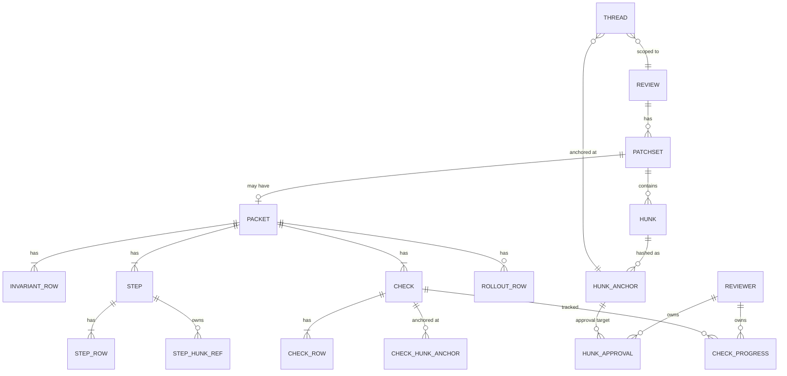
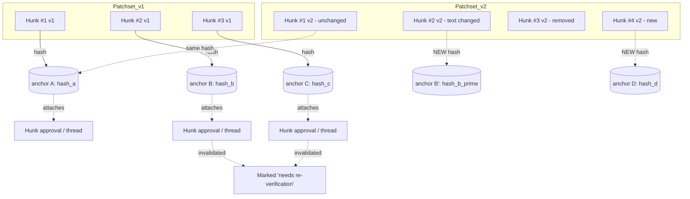

# Review packet: detailed spec

Companion to [`./review-packet-rfc.md`](./review-packet-rfc.md). Covers schema, anchoring, drift behavior, CLI integration, and rendering boundary. Pseudocode is Ecto-flavored; field types are illustrative, not final.

---

## 1. Architecture

```mermaid
flowchart LR
    subgraph Author-side
      Agent[Agent or human author]
      CLI[reviews CLI - Rust]
      PacketFile[".reviews/packet.json"]
      Agent -->|writes| PacketFile
      Agent -->|"reviews push [--update slug]"| CLI
      PacketFile -.read.-> CLI
    end

    subgraph Server[Phoenix / Postgres]
      Ingest[Patchset ingest]
      Anchor[Anchor rehydration]
      DB[(Postgres)]
      CLI -->|HTTPS multipart: diff + packet.json| Ingest
      Ingest --> Anchor
      Anchor --> DB
    end

    subgraph Render[LiveView + React island]
      LV[ReviewLive HEEx]
      Island[@pierre/diffs PatchDiff]
      DB --> LV
      LV -.mounts.-> Island
    end

    Render --> Reviewer
    Reviewer -->|tick, approve, reply| LV
    LV --> DB
```

**Boundary notes:**

- The CLI doesn't *generate* a packet. It picks up `.reviews/packet.json` (or `--packet <path>`) on the author's branch and ships it as part of the upload. Authoring is the agent's job.
- HEEx renders the packet chrome (summary, invariants list, tour outline, testing panel, rollout block, OQ sidebar). The React island is still only used for diff rendering; the packet structure is server-rendered.
- Hunk-anchored interactions (checks, hunk approvals, thread replies) round-trip through normal LiveView events.

## 2. Entity model



The packet is a child of `Patchset`. Threads (including open questions) are already scoped to `Review` and anchored to hunks via content hashes (the existing model). Per-reviewer state lives in separate tables keyed by reviewer + anchor, so it survives patchset updates.

## 3. The Row primitive

Sections are sequences of rows. A row is either prose or a hunk reference.

```elixir
# Pseudocode — illustrative shape only

defmodule Reviews.Packet.Row do
  @type t ::
    {:markdown, mdx :: String.t()}
    | {:hunk, hunk_id :: pos_integer()}
end
```

- **Markdown rows** carry MDX text. A small allowed component palette (see §10) covers pills, reference chips, and inline hunk links. No arbitrary JSX execution; renderer enforces an allowlist.
- **Hunk rows** carry a hunk id (resolved per patchset) plus an implicit content anchor. The renderer interleaves them between prose rows in document order.

## 4. Packet schema

### 4.1 Patchset state

`Patchset` (existing schema in `lib/reviews/reviews/patchset.ex`) gains a state field. Draft pushes overwrite the in-flight `:draft` patchset rather than creating a new visible revision. Numbering is assigned at publish time, not at push time.

```elixir
# Additions to existing Patchset schema:
field :state, Ecto.Enum, values: [:draft, :published], default: :draft
field :published_at, :utc_datetime
# field :number stays, but becomes nullable while :draft

# Unique constraint moves from (review_id, number) to:
# (review_id, number) WHERE state = :published
# plus (review_id) WHERE state = :draft  -- at most one in-flight draft per review
```

Lifecycle:

- `reviews push --draft` upserts the single in-flight `:draft` patchset for the review (overwrites `raw_diff`, `parsed_diff`, attached packet).
- `reviews publish` flips state to `:published`, assigns `number = max(number) + 1`, sets `published_at`. **This is the only event that triggers anchor rehydration and update-delta computation.**
- Subsequent post-publish work starts a new `:draft` patchset; same overwrite semantics until it too is published.

MVP does not preserve intra-draft snapshots. If "agent process telemetry" turns out useful for postmortem, a side table can be added without affecting the user-facing model.

### 4.2 Packet

```elixir
schema "packets" do
  belongs_to :patchset, Patchset

  field :summary, :string
  field :invariants, {:array, :map}     # [Row]; optional, suppresses when empty
  field :tour, {:array, :map}           # [Row]; flat, headings ## / ### come from markdown
  field :testing_instructions, :string  # markdown blob, optional
  field :rollout, {:array, :map}        # [Row], nullable / empty when N/A
  field :format_version, :integer       # for forward compat (see §4.3)

  has_many :tasks, PacketTask           # testing checklist
  # Open questions live in threads with kind=:open_question;
  # they're not stored on the packet itself.

  timestamps()
end

schema "packet_tasks" do
  belongs_to :packet, Packet
  field :ordinal, :integer
  field :description, :string           # markdown string (not [Row])
  field :required_role, :string         # optional: "ops", "design", etc.
end
```

Notes:

- `Row` lists are stored as JSONB arrays. Each row is `%{"kind" => "markdown" | "hunk", ...}`.
- **Tour is flat.** Section boundaries inside the tour come from markdown headings (`##`, `###`) in markdown rows, not from a separate `Step` entity. The renderer and the update-delta computation walk the tour rows and group by heading at render/diff time. Refs like Linear/Slack/Figma chips live as inline `<Pill>` MDX components inside markdown rows, not as a separate `refs` array.
- **Tasks carry no hunk anchors.** A task is just a markdown description. Per-reviewer status (see §7) survives patchset updates by task id; the reviewer manually decides which tasks to re-run based on the delta banner. Tasks that genuinely tie to a hunk can mention it in their description.
- Open questions are *not* a separate table; they piggyback on the existing threads infrastructure with a `kind` discriminator.

**Dedup and carry-forward.** Each `Patchset` row points at one `Packet`, but two patchsets can point at the *same* packet row when the agent's submission is byte-for-byte identical to the prior published one. The server hashes the canonicalized packet on ingest and reuses the prior row when the hash matches; "no packet changes between v1 and v2" then falls out of an `INNER JOIN` and the update delta surfaces it explicitly.

A `reviews publish` may also omit the packet entirely. In that case the server attaches the prior published packet to the new patchset (carry-forward). Useful for small follow-up patchsets that don't move the narrative.

### 4.3 Schema versioning

`format_version` on `packets` exists to absorb evolution of the packet shape without breaking older renders. Strategy:

- **Additive changes** (new optional row kind, new section, new MDX component): no version bump. Renderers must tolerate unknown row/component kinds by rendering a graceful placeholder ("unknown row kind: X, upgrade your renderer").
- **Breaking changes** (renamed field, removed section, semantics shift): bump `format_version`. Renderer dispatches on version; old packets render against the old code path indefinitely.
- **Server validation** rejects packets whose `format_version` is newer than what the server understands. Older packets always parse.
- We don't migrate stored packets between versions. Packet content is immutable once published; the schema evolves around them, not over them.

MVP ships at `format_version: 1` and the policy doesn't bind until v2. The hooks need to be in place now so v2 isn't a breaking lift.

## 5. Threads: open questions vs inline comments

```elixir
schema "threads" do
  belongs_to :review, Review

  field :kind, Ecto.Enum, values: [:inline_comment, :open_question]
  field :state, Ecto.Enum, values: [:open, :answered, :resolved]

  field :anchor, :map  # %{granularity: "hunk" | "token_range", hash: ..., context: ...}
  field :author_kind, Ecto.Enum, values: [:human, :agent]

  has_many :messages, ThreadMessage
  timestamps()
end
```

Open questions are threads where:

- `kind = :open_question`
- `author_kind = :agent` (on creation)
- `state` transitions: `:open` → `:answered` (reviewer replied) → `:resolved` (agent accepted or addressed in next patchset)

This reuses anchoring (already content-hashed) and cross-patchset carry-over (already supported per CLAUDE.md). Don't introduce a parallel data model for OQs.

## 6. Anchoring & drift

Hunks have stable identity *within a patchset only*. Between patchsets, hunks may be added, removed, or modified. State that needs to survive (hunk approvals, threads) anchors to a **content hash** computed from hunk text plus surrounding context, the same mechanism already used for threads. Tasks don't anchor to hunks; their per-reviewer state carries forward by task id (see §7).



**Carry-forward rule.** For each prior anchor `A`:

1. If `A.hash` matches a hunk in the new patchset → state carries forward unchanged.
2. If no match → state is **invalidated, not deleted**. It's surfaced to the reviewer as "needs re-verification" (for hunk approvals) or as "anchor lost" (for threads, which then float in a sidebar bucket).

**When this runs.** Anchor rehydration only fires at publish time. Draft pushes overwrite the in-flight patchset's hunks but don't trigger rehydration; there's no published predecessor to carry state forward from yet. This keeps draft iteration cheap (just an upload) and means reviewer-visible state is only ever computed against published patchsets.

**Prior-patchset coverage map.** When a reviewer approved hunks in v1 and v2 publishes with some hunks unchanged, the carry-forward leaves their prior approval anchors intact. The coverage map at v2 reflects those carried approvals plus any new approvals on v2's new hunks. A reviewer who approved every hunk in v1 will see partial coverage on v2 if v2 introduced new hunks they haven't approved. That's by design: "still approved" is a claim about specific code, not about a revision.

This is the **only** drift mechanism. The MVP does not attempt fuzzy matching beyond the existing thread anchoring code (`Anchoring.relocate/3`). The token-range branch already in the codebase remains stubbed.

## 7. Per-reviewer state

```elixir
schema "reviewer_task_progress" do
  belongs_to :task, PacketTask
  belongs_to :reviewer, User

  field :state, Ecto.Enum,
    values: [:unchecked, :verified, :failed, :skipped]

  field :notes, :string  # optional free text
  field :checked_at, :utc_datetime
end

schema "hunk_approvals" do
  belongs_to :reviewer, User
  belongs_to :review, Review

  field :anchor_hash, :string  # content hash, not patchset-local hunk id
  field :state, Ecto.Enum, values: [:approved, :rejected, :skipped]
  field :at, :utc_datetime
end
```

Notes:

- `reviewer_task_progress` is keyed by `(task_id, reviewer_id)`. Tasks don't anchor to hunks (see §4.2 / §6), so a task's progress simply carries forward by id; the reviewer manually decides to re-run if the delta banner suggests the task is affected.
- `hunk_approvals` are keyed by anchor hash, not hunk id. Carry-forward via the §6 anchoring rule.
- Multiple reviewers' rows coexist. The coverage map is a left-join over the current patchset's tour hunks (resolved to anchors) grouped by reviewer. Section boundaries for the map UX come from markdown headings inside the tour.
- For MVP, no merge gating. These tables are read-only signals for the UI.

## 8. Update delta

When a patchset is **published** (not on draft pushes), the server computes a delta between the newly-published patchset and the prior published one:

```elixir
%{
  open_questions_addressed: [thread_id, ...],
  open_questions_resolved:  [thread_id, ...],
  tour_sections_changed: [
    # sections derived from markdown headings inside the tour
    %{heading: "Add invalidate/1 call", kind: :hunks_modified},
    %{heading: "Regression test",      kind: :added},
  ],
  invariants_added: [row_index, ...],
  invariants_removed: [...],
  tasks_added:   [task_id, ...],
  tasks_removed: [task_id, ...],
  reverification_suggested: %{
    # advisory only — reviewer decides; tasks don't auto-invalidate (§7)
    tasks:     [task_id, ...],
    approvals: [anchor_hash, ...]
  }
}
```

```mermaid
sequenceDiagram
    participant Agent
    participant Server
    participant DB

    Agent->>Server: reviews push --draft (one or more times)
    Server->>DB: upsert in-flight :draft patchset
    Note over Server,DB: no rehydration, no delta; draft pushes are cheap

    Agent->>Server: reviews publish
    Server->>DB: assign number=2, state=:published, persist packet v2

    Server->>Server: compute anchor set Av2
    Server->>DB: carry forward matching anchors, invalidate lost ones

    Server->>Server: diff packet v1 vs packet v2 (OQ state, steps, invariants)
    Server->>DB: persist delta blob

    Server-->>Agent: 200 OK { delta }
```

The delta is computed once at ingest and persisted. The LiveView reads it as a single record rather than recomputing on every render.

## 9. CLI integration

### 9.1 File layout

Two locations:

- **`~/.config/reviews/`** is global. Holds user config (server URL, auth token, default editor). One per user, not per checkout.
- **`.reviews/`** is per-checkout. Gitignored. Holds the local SQLite cache and any in-progress packet files. Worktrees naturally get their own because each is on its own branch with its own working tree.

```
~/.config/reviews/
└── config.toml                        # server URL, auth token, defaults

<repo>/
├── .reviews/                          # gitignored, per-checkout
│   ├── state.db                       # SQLite: reviews, threads, task progress, sync state
│   └── drafts/                        # in-progress packets (text, agent-edited)
│       └── <branch-sanitized>/
│           └── packet.json
├── src/
└── ...
```

Branch names are sanitized to filesystem-safe characters (slashes → `__`, etc.). A branch literally named `drafts` is special-cased — the sanitizer reserves the top-level `drafts/` and routes a branch-named-`drafts` to `drafts/_drafts/packet.json` or refuses with a clear message. Edge case, documented, not load-bearing.

The in-progress packet stays a JSON file rather than a SQLite row for three reasons: agents edit it like any other source file, it's a single ~kb artifact, and text diffs are useful when iterating on the packet itself.

### 9.2 Commands

```
# Author a packet, validate before pushing:
$ reviews validate                    # parses drafts/<branch>/packet.json, checks schema,
                                      # resolves hunk references against current diff,
                                      # exits non-zero with line-pointed errors

$ reviews push --dry-run              # validate + print what would be sent (slug, truncated
                                      # diff, packet shape); no network call

# First push to a fresh review (creates a draft patchset):
$ reviews push --draft                # picks up drafts/<branch>/packet.json

# Iterate on the in-flight draft (overwrites server-side):
$ reviews push --draft                # same command; server identifies the draft
$ reviews push --draft --packet foo.json

# Hand off to reviewers:
$ reviews publish <slug>              # finalizes the draft → patchset v1, notifies

# Sync reviewer state into the local cache:
$ reviews sync                        # fetches threads + task progress into state.db
$ reviews threads                     # SELECT-backed summary of open threads
$ reviews threads --state=open --kind=oq

# After feedback, prepare the next revision:
$ reviews push --draft                # creates a new in-flight draft patchset
$ reviews publish <slug>              # finalizes → patchset v2, computes delta
```

`reviews sync` is also called implicitly after `reviews publish` so the agent has fresh thread state by the time the next iteration starts.

**Note on `--update`.** The previous `reviews push --update <slug>` invocation is deprecated in favor of the explicit draft-then-publish flow. The CLI still accepts it as a compatibility alias that maps to `push --draft && publish` for human authors who don't want the two-step affordance.

### 9.3 Packet file format

```jsonc
{
  "format_version": 1,
  "summary": "Invalidate search cache on document delete",
  "invariants": [
    { "kind": "markdown", "body": "Cache is invalidated whenever a document is deleted." },
    { "kind": "hunk", "path": "test/search_cache_invalidation_test.exs", "anchor": "..." }
  ],
  "tour": [
    { "kind": "markdown", "body": "## Add invalidate/1 call to Documents.delete/1\n\nHooks into the existing delete transaction so the cache clear is atomic. <Pill kind=\"linear\" href=\"https://linear.app/...\">LIN-4892</Pill>" },
    { "kind": "hunk", "path": "lib/documents.ex", "anchor": "..." },
    { "kind": "markdown", "body": "## Regression test\n\nReproduces the bug from <Pill kind=\"linear\" href=\"https://linear.app/...\">LIN-4892</Pill>." },
    { "kind": "hunk", "path": "test/search_cache_invalidation_test.exs", "anchor": "..." }
  ],
  "testing_instructions": "Open a search session, delete a doc, confirm the result list refreshes.",
  "tasks": [
    { "description": "Delete a document via the UI; confirm it disappears from search results within 2s." },
    { "description": "Visit the preview URL and verify the new test passes in CI." }
  ],
  "rollout": null,
  "open_questions": [
    {
      "anchor": { "path": "lib/documents.ex", "hash": "...", "context": "..." },
      "body": "Should we backfill: clear the cache for docs deleted in the last 24h?"
    }
  ]
}
```

The tour example above uses two flat `markdown` rows with `## ` headings, interleaved with `hunk` rows. The renderer derives section boundaries from those headings.

### 9.4 Local state — SQLite schema

`state.db` is a SQLite database cached from the server. The server is the source of truth; deleting `state.db` is harmless and a `reviews sync` rebuilds it. WAL mode is enabled so concurrent CLI invocations (agent + human, or two agent worktrees pointed at the same checkout) don't race.

```sql
CREATE TABLE reviews (
  slug             TEXT PRIMARY KEY,
  branch           TEXT NOT NULL,
  state            TEXT NOT NULL,         -- draft | in_review | approved
  current_patchset INTEGER,
  last_synced_at   TIMESTAMP,
  last_pushed_at   TIMESTAMP
);

CREATE TABLE threads (
  id              INTEGER PRIMARY KEY,    -- server-assigned
  review_slug     TEXT NOT NULL REFERENCES reviews(slug) ON DELETE CASCADE,
  kind            TEXT NOT NULL,          -- open_question | inline_comment
  state           TEXT NOT NULL,          -- open | answered | resolved
  anchor_path     TEXT,
  anchor_hash     TEXT,
  body            TEXT,
  last_message_at TIMESTAMP
);
CREATE INDEX threads_by_review_state ON threads(review_slug, state);

CREATE TABLE thread_messages (
  id        INTEGER PRIMARY KEY,
  thread_id INTEGER NOT NULL REFERENCES threads(id) ON DELETE CASCADE,
  author    TEXT,
  body      TEXT,
  at        TIMESTAMP
);

CREATE TABLE task_progress (
  task_id      INTEGER NOT NULL,
  reviewer     TEXT NOT NULL,
  state        TEXT NOT NULL,             -- unchecked | verified | failed | skipped
  notes        TEXT,
  checked_at   TIMESTAMP,
  PRIMARY KEY (task_id, reviewer)
);
```

### 9.5 Rust migration strategy

The CLI uses [`rusqlite_migration`](https://crates.io/crates/rusqlite_migration) (or equivalent) with forward-only migrations embedded in the binary. Migrations are addressed by `PRAGMA user_version` and applied in order at startup before any other query runs.

```rust
// cli/src/db/migrations.rs (sketch)
use rusqlite_migration::{Migrations, M};

pub fn migrations() -> Migrations<'static> {
    Migrations::new(vec![
        M::up(include_str!("../../migrations/V1__initial.sql")),
        M::up(include_str!("../../migrations/V2__add_task_progress.sql")),
        // future migrations append here
    ])
}

pub fn open_or_init(path: &Path) -> Result<Connection> {
    let mut conn = Connection::open(path)?;
    conn.pragma_update(None, "journal_mode", "WAL")?;
    conn.pragma_update(None, "foreign_keys", "ON")?;
    migrations().to_latest(&mut conn)?;
    Ok(conn)
}
```

Conventions:

- Migrations are forward-only. No `down` migrations in MVP; if a fresh `state.db` is needed the user deletes it and re-syncs.
- Each migration is a single `.sql` file in `cli/migrations/`, named `V{n}__{summary}.sql`.
- Schema changes that aren't strictly additive (renames, drops, type changes) require a migration plus a `reviews sync` to repopulate.
- The `state.db` is regenerable from the server, so migration safety isn't load-bearing the way it would be for the Phoenix DB. A "blow it away" recovery path is always available.
- The CLI logs the applied migration sequence in verbose mode for debugging when the schema seems wrong.

If migrations fail at startup, the CLI prints the failing migration name + SQLite error and exits non-zero. It does *not* attempt automatic recovery — the user can delete `state.db` to start fresh.

### 9.6 Hunk identification on the author side

The agent doesn't have hunk *ids* (those are assigned server-side after diff parsing). It identifies hunks by `(path, anchor)` where anchor is a content hash computed by the CLI from the local diff. The server matches these against the parsed patchset.

### 9.7 Validation

Server rejects packets with:

- malformed rows
- hunk references that don't resolve in the uploaded diff
- duplicate OQ anchors
- unknown MDX components in markdown rows

`reviews validate` runs the same checks client-side (modulo server-side hunk parsing, which it approximates by parsing the local diff). Designed to be called by agents in a generate-validate loop before the network round-trip.

## 10. MDX prose fields

Markdown rows accept MDX with a fixed component palette. No arbitrary JSX; the renderer parses with an allowlist.

| Component | Purpose | Example |
| --- | --- | --- |
| `<Pill kind="..." href="..." />` | External reference chip (Linear, Slack, Figma, Notion, docs) | `<Pill kind="linear" href="...">LIN-4892</Pill>` |
| `<HunkLink anchor="..." />` | Cross-reference to a hunk in this patchset | "see <HunkLink anchor="..."/> for the audit" |
| `<StepLink ordinal={3} />` | Cross-reference to a tour step | "fixed in <StepLink ordinal={3}/>" |
| `<Evidence href="..." />` | Pointer at a test, lint, or external check | `<Evidence href="test/foo.exs:42"/>` |
| `<Note kind="warn" />` | Inline callout (warn / info / risk) | `<Note kind="warn">Migration is non-reversible</Note>` |

**Crucially, `<PatchDiff>` is not in the palette.** Hunks live as their own `Row` kind, not embedded in MDX. This keeps the React island scoped (the diff renderer doesn't need to be invoked from inside parsed prose) and keeps the schema queryable (hunk references aren't hidden inside markdown text).

**Rendering.** Server-side: MDX compiled to HTML via a sandboxed pipeline (likely Rust-side `markdown-rs` plus an allowlist pass; details deferred). The result is injected into the LiveView template. The five components above are either:

- pure presentation (`<Pill>`, `<Note>`, `<Evidence>`) → rendered as HEEx components, or
- interactive (`<HunkLink>`, `<StepLink>`) → rendered as `<.link>` elements that scroll/highlight via a tiny inline colocated hook.

No new React island.

## 11. LiveView / React boundary

| Layer | Responsibility |
| --- | --- |
| HEEx (LiveView) | Page chrome, summary, invariants list, tour outline & headings, testing panel, rollout block, OQ sidebar, all stateful interactions (tick, approve, reply) |
| Colocated JS hooks | Small affordances: `HunkLink` scroll behavior, copy-to-clipboard, anchor highlighting |
| `phx-hook="DiffRenderer"` React island | Diff rendering only (`@pierre/diffs` `PatchDiff`) |
| Server-side MDX compile | Markdown rows → HTML with allowlisted components inlined as HEEx |

The diff renderer needs one capability it may not already have: **accepting an arbitrary hunk order** and/or **rendering a subset of hunks** for a tour step. If `<PatchDiff>` is strictly file-grouped, the tour can either (a) render a custom hunk component for tour steps and use `<PatchDiff>` only for the "Other" / flat view, or (b) we contribute upstream support for hunk-ordered rendering. Decision deferred until the React side is inspected.

## 12. Validation, errors, edge cases

- **Empty sections suppress.** Only `summary` is required. Invariants, tour, testing (instructions + tasks), deploy, and open questions all disappear from the rendered packet when empty. **Invariants in particular is optional** — small changes don't need them, and a missing block is just a missing block, not a quality signal.
- **Hunks not referenced by any tour markdown.** Land in an "Other" bucket at the end of the tour with no surrounding prose. The agent should be nudged to keep this small via prompt design, not enforced server-side.
- **OQ anchor lost across patchsets.** Surfaces in a sidebar bucket "orphaned threads"; reviewer can manually re-anchor or dismiss. Same behavior as inline comments today.
- **Reviewer leaves a thread reply on an OQ then it's deleted by the agent in v2.** The thread isn't deleted; the OQ row's anchor is just gone from v2's hunks → moved to orphan bucket.

## 13. Future work (out of MVP)

- **Cross-packet linking.** Sibling-packet chips, cross-service invariants with evidence in another repo's test suite, cascading thread replies. Story 4 in the RFC. Treat as separate schema additions on top of the single-packet model; don't pre-bake the interface.
- **Merge gating tied to coverage.** Require N approvals per tour section, designated reviewers for tasks with a `required_role`, etc. Pure policy layer once the data model is in place.
- **Automated invariant verification.** Tie an invariant to a test or property check; surface red when it fails.
- **Reference integrations.** Linear / Slack / Figma / Notion APIs to render rich previews on `<Pill>` hover.
- **Editable packet post-push.** A reviewer-friendly correction mode that doesn't require a new patchset.
- **Reviewer-facing reordering.** Sort by reviewed-first, by file kind, by hunk size. Orthogonal to the tour-driven ordering.
- **Sparse packet updates.** Today the agent submits the full packet (or omits it entirely for carry-forward). A middle ground would let the agent submit only changed sections, with omitted sections inherited from the prior published packet. Useful when only the tour changes but invariants and testing are stable. Adds submission complexity and prompt complexity; not load-bearing for MVP.

## 14. Test plan sketch

For the MVP we need test coverage on:

1. **Packet parse / validate.** Well-formed and malformed packets, unknown row kinds, unknown MDX components, missing required fields.
2. **Anchor rehydration.** Pat v1 hunks H1/H2/H3 with attached state, Pat v2 with H1 unchanged, H2 modified, H3 deleted, H4 new. Assert state on H1 carries, state on H2/H3 invalidated and surfaced, no spurious state on H4.
3. **Update delta computation.** Known prior packet + new packet, assert delta record fields.
4. **Per-reviewer task progress.** Alice ticks task X, Bob sees Alice's tick but his own is independent. Carries forward by task id across patchsets.
5. **Hunk approval coverage map.** Query groups by tour-section (derived from markdown headings) and returns per-reviewer approval state.
6. **OQ lifecycle.** Agent opens, reviewer replies (transitions to `:answered`), agent's next patchset includes resolution (transitions to `:resolved`).
7. **Rendering.** Golden tests for the rendered LiveView with each section populated / empty.

Existing test suite is 27 tests; this proposal adds roughly 20–30 tests at the unit + integration level.
