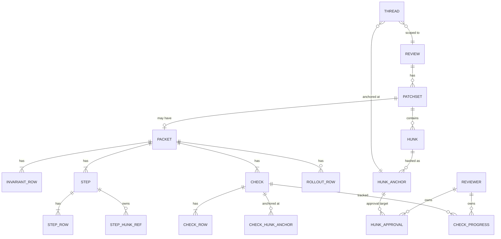
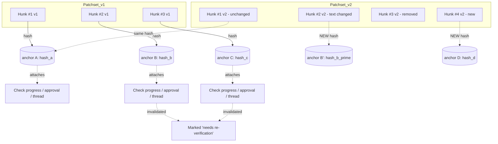
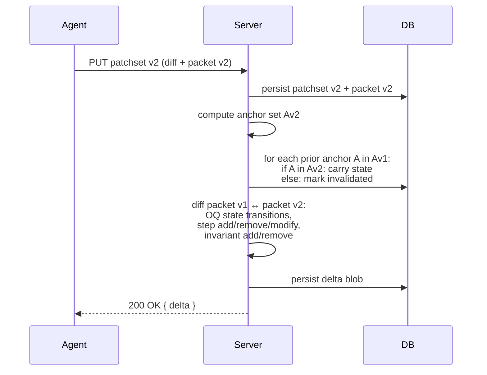

# Review Packet — Detailed Spec

Companion to [`./review-packet-rfc.md`](./review-packet-rfc.md). Covers schema, anchoring, drift behavior, CLI integration, and rendering boundary. Pseudocode is Ecto-flavored; field types are illustrative, not final.

---

## 1. Architecture

```mermaid
flowchart LR
    subgraph Author-side
      Agent[Agent or human author]
      CLI[reviews CLI - Rust]
      PacketFile[".reviews/packet.json"]
      Agent -->|writes| PacketFile
      Agent -->|"reviews push [--update slug]"| CLI
      PacketFile -.read.-> CLI
    end

    subgraph Server[Phoenix / Postgres]
      Ingest[Patchset ingest]
      Anchor[Anchor rehydration]
      DB[(Postgres)]
      CLI -->|HTTPS multipart: diff + packet.json| Ingest
      Ingest --> Anchor
      Anchor --> DB
    end

    subgraph Render[LiveView + React island]
      LV[ReviewLive HEEx]
      Island[@pierre/diffs PatchDiff]
      DB --> LV
      LV -.mounts.-> Island
    end

    Render --> Reviewer
    Reviewer -->|tick, approve, reply| LV
    LV --> DB
```

**Boundary notes:**

- The CLI doesn't *generate* a packet. It picks up `.reviews/packet.json` (or `--packet <path>`) on the author's branch and ships it as part of the upload. Authoring is the agent's job.
- HEEx renders the packet chrome (summary, invariants list, tour outline, testing panel, rollout block, OQ sidebar). The React island is still only used for diff rendering; the packet structure is server-rendered.
- Hunk-anchored interactions (checks, hunk approvals, thread replies) round-trip through normal LiveView events.

## 2. Entity model



The packet is a child of `Patchset`. Threads (including open questions) are already scoped to `Review` and anchored to hunks via content hashes — the existing model. Per-reviewer state lives in separate tables keyed by reviewer + anchor, so it survives patchset updates.

## 3. The Row primitive

Sections are sequences of rows. A row is either prose or a hunk reference.

```elixir
# Pseudocode — illustrative shape only

defmodule Reviews.Packet.Row do
  @type t ::
    {:markdown, mdx :: String.t()}
    | {:hunk, hunk_id :: pos_integer()}
end
```

- **Markdown rows** carry MDX text. A small allowed component palette (see §10) covers pills, reference chips, and inline hunk links. No arbitrary JSX execution; renderer enforces an allowlist.
- **Hunk rows** carry a hunk id (resolved per patchset) plus an implicit content anchor. The renderer interleaves them between prose rows in document order.

## 4. Packet schema

```elixir
schema "packets" do
  belongs_to :patchset, Patchset

  field :summary, :string
  field :invariants, {:array, :map}     # [Row]
  field :rollout, {:array, :map}        # [Row], nullable / empty when N/A
  field :format_version, :integer       # for forward compat

  has_many :steps, Step                 # tour steps, ordered
  has_many :checks, Check               # testing checks, ordered
  # Open questions live in threads with kind=:open_question;
  # they're not stored on the packet itself.

  timestamps()
end

schema "packet_steps" do
  belongs_to :packet, Packet
  field :ordinal, :integer
  field :heading, :string
  field :body, {:array, :map}           # [Row]
  field :refs, {:array, :map}           # [{label, url, kind}]
  field :hunk_ids, {:array, :integer}   # hunks owned by this step
end

schema "packet_checks" do
  belongs_to :packet, Packet
  field :ordinal, :integer
  field :body, {:array, :map}           # [Row]
  field :hunk_anchors, {:array, :string} # content-hashed; for drift detection
  field :required_role, :string         # optional: "ops", "design", etc.
end
```

Notes:

- `Row` lists are stored as JSONB arrays. Each row is `%{"kind" => "markdown" | "hunk", ...}`.
- `Step.hunk_ids` references hunks in *this patchset*. The anchoring layer is responsible for tracking the same step across patchsets if needed for delta computation; the persisted hunk ids are patchset-local.
- `Check.hunk_anchors` are content-hashed, not patchset-local ids. This is what makes check progress survive updates (see §6).
- Open questions are *not* a separate table — they piggyback on the existing threads infrastructure with a `kind` discriminator.

## 5. Threads — open questions vs inline comments

```elixir
schema "threads" do
  belongs_to :review, Review

  field :kind, Ecto.Enum, values: [:inline_comment, :open_question]
  field :state, Ecto.Enum, values: [:open, :answered, :resolved]

  field :anchor, :map  # %{granularity: "hunk" | "token_range", hash: ..., context: ...}
  field :author_kind, Ecto.Enum, values: [:human, :agent]

  has_many :messages, ThreadMessage
  timestamps()
end
```

Open questions are threads where:

- `kind = :open_question`
- `author_kind = :agent` (on creation)
- `state` transitions: `:open` → `:answered` (reviewer replied) → `:resolved` (agent accepted or addressed in next patchset)

This reuses anchoring (already content-hashed) and cross-patchset carry-over (already supported per CLAUDE.md). Don't introduce a parallel data model for OQs.

## 6. Anchoring & drift

Hunks have stable identity *within a patchset only*. Between patchsets, hunks may be added, removed, or modified. State that needs to survive (check progress, hunk approvals, threads) anchors to a **content hash** computed from hunk text plus surrounding context — the same mechanism already used for threads.



**Carry-forward rule.** For each prior anchor `A`:

1. If `A.hash` matches a hunk in the new patchset → state carries forward unchanged.
2. If no match → state is **invalidated, not deleted**. It's surfaced to the reviewer as "needs re-verification" (for checks/approvals) or as "anchor lost" (for threads, which then float in a sidebar bucket).

This is the **only** drift mechanism. The MVP does not attempt fuzzy matching beyond the existing thread anchoring code (`Anchoring.relocate/3`). The token-range branch already in the codebase remains stubbed.

## 7. Per-reviewer state

```elixir
schema "reviewer_check_progress" do
  belongs_to :check, Check
  belongs_to :reviewer, User

  field :state, Ecto.Enum,
    values: [:unchecked, :verified, :failed, :skipped]

  field :notes, :string  # optional free text
  field :checked_at, :utc_datetime
end

schema "hunk_approvals" do
  belongs_to :reviewer, User
  belongs_to :review, Review

  field :anchor_hash, :string  # content hash, not patchset-local hunk id
  field :state, Ecto.Enum, values: [:approved, :rejected, :skipped]
  field :at, :utc_datetime
end
```

Notes:

- `hunk_approvals` are keyed by anchor hash, not hunk id. Same carry-forward as checks.
- Multiple reviewers' rows coexist. The coverage map is a left-join from `Step.hunk_ids` (resolved to anchors for the current patchset) over `hunk_approvals` grouped by reviewer.
- For MVP, no merge gating — these tables are read-only signals for the UI.

## 8. Update delta

When a new patchset lands, the server computes a delta between it and the prior packet:

```elixir
%{
  open_questions_addressed: [thread_id, ...],
  open_questions_resolved:  [thread_id, ...],
  steps_changed: [
    %{step_ordinal: 2, kind: :hunks_modified},
    %{step_ordinal: 5, kind: :added},
  ],
  invariants_added: [row_index, ...],
  invariants_removed: [...],
  reverification_needed: %{
    checks: [check_id, ...],
    approvals: [anchor_hash, ...]
  }
}
```



The delta is computed once at ingest and persisted. The LiveView reads it as a single record rather than recomputing on every render.

## 9. CLI integration

```
$ tree -L 2 myrepo/
myrepo/
├── .reviews/
│   └── packet.json
├── src/
└── ...

$ reviews push                  # picks up .reviews/packet.json if present
$ reviews push --packet foo.json
$ reviews push --update <slug>  # treats as patchset update; computes delta server-side
```

**Packet file format:**

```jsonc
{
  "format_version": 1,
  "summary": "Invalidate search cache on document delete",
  "invariants": [
    { "kind": "markdown", "body": "Cache is invalidated whenever a document is deleted." },
    { "kind": "hunk", "path": "test/search_cache_invalidation_test.exs", "anchor": "..." }
  ],
  "tour": [
    {
      "heading": "Add invalidate/1 call to Documents.delete/1",
      "body": [
        { "kind": "markdown", "body": "Hooks into the existing delete transaction so the cache clear is atomic." }
      ],
      "hunks": [{ "path": "lib/documents.ex", "anchor": "..." }],
      "refs": [
        { "label": "LIN-4892", "url": "https://linear.app/...", "kind": "ticket" },
        { "label": "Slack thread", "url": "https://slack.com/...", "kind": "discussion" }
      ]
    }
  ],
  "testing": [
    {
      "body": [
        { "kind": "markdown", "body": "Delete a document while a search session is open. Confirm results refresh." }
      ],
      "hunks": [{ "path": "lib/documents.ex", "anchor": "..." }]
    }
  ],
  "rollout": null,
  "open_questions": [
    {
      "anchor": { "path": "lib/documents.ex", "hash": "...", "context": "..." },
      "body": "Should we backfill: clear the cache for docs deleted in the last 24h?"
    }
  ]
}
```

**Hunk identification on the author side.** The agent doesn't have hunk *ids* (those are assigned server-side after diff parsing). It identifies hunks by `(path, anchor)` where anchor is a content hash computed by the CLI from the local diff. The server matches these against the parsed patchset.

**Validation.** Server rejects packets with:

- malformed rows
- hunk references that don't resolve in the uploaded diff
- duplicate OQ anchors
- unknown MDX components in markdown rows

## 10. MDX prose fields

Markdown rows accept MDX with a fixed component palette. No arbitrary JSX; the renderer parses with an allowlist.

| Component | Purpose | Example |
| --- | --- | --- |
| `<Pill kind="..." href="..." />` | External reference chip (Linear, Slack, Figma, Notion, docs) | `<Pill kind="linear" href="...">LIN-4892</Pill>` |
| `<HunkLink anchor="..." />` | Cross-reference to a hunk in this patchset | "see <HunkLink anchor="..."/> for the audit" |
| `<StepLink ordinal={3} />` | Cross-reference to a tour step | "fixed in <StepLink ordinal={3}/>" |
| `<Evidence href="..." />` | Pointer at a test, lint, or external check | `<Evidence href="test/foo.exs:42"/>` |
| `<Note kind="warn" />` | Inline callout (warn / info / risk) | `<Note kind="warn">Migration is non-reversible</Note>` |

**Crucially, `<PatchDiff>` is not in the palette.** Hunks live as their own `Row` kind, not embedded in MDX. This keeps the React island scoped (the diff renderer doesn't need to be invoked from inside parsed prose) and keeps the schema queryable (hunk references aren't hidden inside markdown text).

**Rendering.** Server-side: MDX compiled to HTML via a sandboxed pipeline (likely Rust-side `markdown-rs` plus an allowlist pass; details deferred). The result is injected into the LiveView template. The five components above are either:

- pure presentation (`<Pill>`, `<Note>`, `<Evidence>`) → rendered as HEEx components, or
- interactive (`<HunkLink>`, `<StepLink>`) → rendered as `<.link>` elements that scroll/highlight via a tiny inline colocated hook.

No new React island.

## 11. LiveView / React boundary

| Layer | Responsibility |
| --- | --- |
| HEEx (LiveView) | Page chrome, summary, invariants list, tour outline & headings, testing panel, rollout block, OQ sidebar, all stateful interactions (tick, approve, reply) |
| Colocated JS hooks | Small affordances: `HunkLink` scroll behavior, copy-to-clipboard, anchor highlighting |
| `phx-hook="DiffRenderer"` React island | Diff rendering only — `@pierre/diffs` `PatchDiff` |
| Server-side MDX compile | Markdown rows → HTML with allowlisted components inlined as HEEx |

The diff renderer needs one capability it may not already have: **accepting an arbitrary hunk order** and/or **rendering a subset of hunks** for a tour step. If `<PatchDiff>` is strictly file-grouped, the tour can either (a) render a custom hunk component for tour steps and use `<PatchDiff>` only for the "Other" / flat view, or (b) we contribute upstream support for hunk-ordered rendering. Decision deferred until the React side is inspected.

## 12. Validation, errors, edge cases

- **Empty sections.** Rollout and open questions disappear from the rendered packet when empty. Invariants and testing are always shown (even if testing says "no manual verification needed" — that's a positive signal).
- **Hunks not referenced by any tour step.** Land in an "Other" bucket at the end of the tour with no prose. Agent should be nudged to keep this small via prompt design, not enforced server-side.
- **OQ anchor lost across patchsets.** Surfaces in a sidebar bucket "orphaned threads"; reviewer can manually re-anchor or dismiss. Same behavior as inline comments today.
- **Check anchor lost.** State is preserved but flagged "needs re-verification" with the prior reviewer + timestamp visible.
- **Reviewer leaves a thread reply on an OQ then it's deleted by the agent in v2.** The thread isn't deleted; the OQ row's anchor is just gone from v2's hunks → moved to orphan bucket.

## 13. Future work (out of MVP)

- **Cross-packet linking.** Sibling-packet chips, cross-service invariants with evidence in another repo's test suite, cascading thread replies. Story 4 in the RFC. Treat as separate schema additions on top of the single-packet model — don't pre-bake the interface.
- **Merge gating tied to coverage.** Require N approvals per step, designated reviewers for `required_role` checks, etc. Pure policy layer once the data model is in place.
- **Automated invariant verification.** Tie an invariant to a test or property check; surface red when it fails.
- **Reference integrations.** Linear / Slack / Figma / Notion APIs to render rich previews on `<Pill>` hover.
- **Editable packet post-push.** A reviewer-friendly correction mode that doesn't require a new patchset.
- **Reviewer-facing reordering.** Sort by reviewed-first, by file kind, by hunk size — orthogonal to the tour-driven ordering.

## 14. Test plan sketch

For the MVP we need test coverage on:

1. **Packet parse / validate** — well-formed and malformed packets, unknown row kinds, unknown MDX components, missing required fields.
2. **Anchor rehydration** — Pat v1 hunks H1/H2/H3 with attached state, Pat v2 with H1 unchanged, H2 modified, H3 deleted, H4 new. Assert state on H1 carries, state on H2/H3 invalidated and surfaced, no spurious state on H4.
3. **Update delta computation** — known prior packet + new packet, assert delta record fields.
4. **Per-reviewer check progress** — Alice ticks check X, Bob sees Alice's tick but his own is independent.
5. **Hunk approval coverage map** — query returns per-step, per-reviewer approval state.
6. **OQ lifecycle** — agent opens, reviewer replies (transitions to `:answered`), agent's next patchset includes resolution (transitions to `:resolved`).
7. **Rendering** — golden tests for the rendered LiveView with each section populated / empty.

Existing test suite is 27 tests; this proposal adds roughly 20–30 tests at the unit + integration level.
