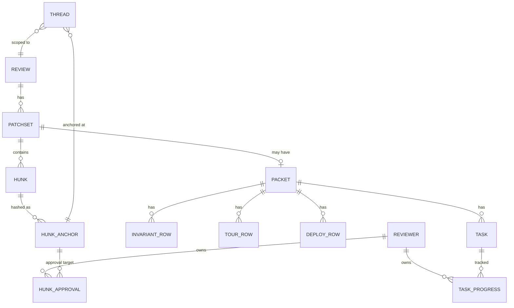
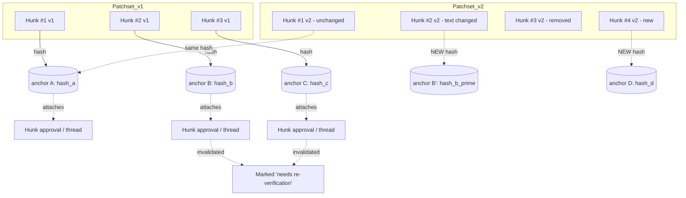
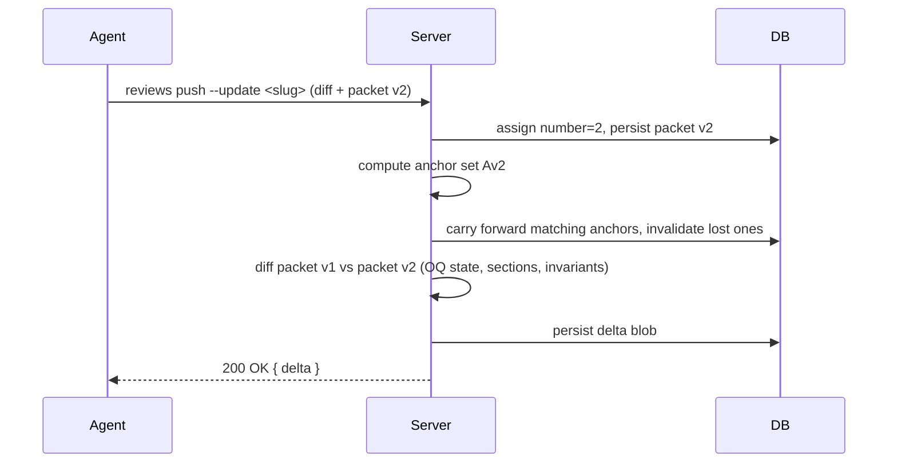

# Review packet: detailed spec

Companion to [`./review-packet-rfc.md`](./review-packet-rfc.md). Covers schema, anchoring, drift behavior, CLI integration, and rendering boundary. Pseudocode is Ecto-flavored; field types are illustrative, not final.

---

## 1. Architecture

```mermaid
flowchart LR
    subgraph Author-side
      Agent[Agent or human author]
      CLI[reviews CLI - Rust]
      PacketFile[".reviews/branch/packet.json"]
      Agent -->|writes| PacketFile
      Agent -->|"reviews push [--update slug]"| CLI
      PacketFile -.read.-> CLI
    end

    subgraph Server[Phoenix / Postgres]
      Ingest[Patchset ingest]
      Anchor[Anchor rehydration]
      DB[(Postgres)]
      CLI -->|HTTPS multipart: diff + packet.json| Ingest
      Ingest --> Anchor
      Anchor --> DB
    end

    subgraph Render[LiveView + React island]
      LV[ReviewLive HEEx]
      Island[@pierre/diffs PatchDiff]
      DB --> LV
      LV -.mounts.-> Island
    end

    Render --> Reviewer
    Reviewer -->|tick, approve, reply| LV
    LV --> DB
```

**Boundary notes:**

- The CLI doesn't *generate* a packet. It picks up `.reviews/<branch>/packet.json` (or `--packet <path>`) on the author's branch and ships it as part of the upload. Authoring is the agent's job.
- HEEx renders the packet chrome (title, summary, invariants list, tour outline, testing panel, deploy block, OQ sidebar). The React island is still only used for diff rendering; the packet structure is server-rendered.
- Hunk-anchored interactions (hunk approvals, thread replies) round-trip through normal LiveView events.

## 2. Vocabulary and anchors

A handful of concepts ground the rest of the spec. They nest:

```
commit ──→ diff ──→ hunk ──→ token (deferred)
                     │
                     └─→ anchor (content hash)

patchset ──→ diff
packet ───→ patchset
```

- **Commit.** A git commit on the author's branch. The author makes one or more commits locally; the CLI is unaware of them individually, since it works with the *diff* between the branch base and HEAD.
- **Diff.** Unified-diff text representing the cumulative change. Generated by the CLI from `git diff <base>...HEAD`. One diff per push.
- **Hunk.** A single contiguous block in a diff: a file path, a line range, the +/- lines, plus a few lines of surrounding context. A diff is a sequence of hunks, and hunks are how reviewers navigate and how interactive state attaches to the code.
- **Token.** A finer-grained range inside a hunk (a function name, an argument, a specific identifier). Out of MVP scope; the existing thread schema has a stubbed `token_range` granularity branch (see CLAUDE.md). Tokens get anchored the same way hunks do when they ship.
- **Patchset.** A versioned diff attached to a review, numbered 1, 2, 3. Each `reviews push` creates one. The current patchset is what reviewers see.
- **Packet.** The structured metadata (title, summary, invariants, tour, testing, deploy, OQs) attached to a patchset. Optional; many patchsets won't have one. The packet is what this spec is about.

### 2.1 Anchors

An **anchor** is a content hash that identifies a hunk by its text rather than its position in a diff. Hunks at the same file path move between patchsets as the diff evolves; anchors stay stable as long as their underlying content does.

Anchors are the carrier for any state that must survive patchset updates: inline comments, open questions, hunk approvals. The carry-forward rule in §7 is "if the anchor matches, state carries forward; otherwise it invalidates."

### 2.2 Anchor algorithm

For a hunk at file `path` with diff body `lines` (the +/- text) and surrounding context `ctx`:

```
anchor(path, lines, ctx) = sha256(
    "anchor:v1\n"
  + path + "\n"
  + normalize(ctx.before) + "\n"
  + normalize(lines)      + "\n"
  + normalize(ctx.after)  + "\n"
)
```

Where:

- **`ctx.before`** is the 3 lines immediately preceding the hunk in the parent file; **`ctx.after`** is the 3 lines immediately following. Both are unified-diff context lines (the lines prefixed with a space in the diff format).
- **`normalize`** strips trailing whitespace per line and normalizes line endings to `\n`. Indentation and case are preserved — both are meaningful to hunk identity.
- **`"anchor:v1\n"`** prefix is a hash domain separator. Bumping to `v2` if the algorithm ever changes prevents old and new anchors from colliding silently.
- **Path is included** so the same change in two different files produces different anchors. File renames are not handled in MVP — a renamed file produces a new anchor and the old state invalidates.

The hash is stored as a hex string. Anchors live on the server canonically and are recomputed by the CLI from the local diff so packets can reference hunks by `(path, anchor)` without a server round-trip (see §10).

### 2.3 What this gives us

- **Stable identity for state attached to a hunk.** If a reviewer approved a hunk in patchset v1 and that same hunk text + context appears unchanged in v2, the approval carries.
- **Cheap drift detection.** If the hash differs, the state invalidates. No fuzzy matching, no diff-of-diffs.
- **Cross-patchset thread anchoring.** Inline comments anchored to v1 hunks remain attached in v2 when the hunks are unchanged, and surface as "orphaned" when they're not.
- **Trivial agent-side computation.** The CLI parses its own local diff and produces matching hashes, so packets can reference hunks before the server has assigned ids.

Anchor stability is content-only. Refactors that rewrap a line, change indentation, or modify surrounding context will invalidate anchors. That's by design — "still approved" must be a claim about the code as it appears in the new patchset, not a stale pointer.

## 3. Entity model



The packet is a child of `Patchset`. Threads (including open questions) are scoped to `Review` and anchored to hunks via content hashes (see §2.2). Per-reviewer state lives in separate tables keyed by reviewer + anchor (for hunk approvals) or reviewer + stable task key (for task progress), so it survives patchset updates.

## 4. The Row primitive

Sections are sequences of rows. A row is either prose or a hunk reference.

```elixir
# Pseudocode — illustrative shape only

defmodule Reviews.Packet.Row do
  @type t ::
    {:markdown, body :: String.t()}
    | {:hunk, hunk_id :: pos_integer()}
end
```

- **Markdown rows** carry plain CommonMark. URL auto-tagging (§11.1) and hunk anchor links (§11.2) are the only render-time magic; there is no custom component palette and no JSX.
- **Hunk rows** carry a hunk id (resolved per patchset) plus an implicit content anchor. The renderer interleaves them between prose rows in document order.

## 5. Packet schema

### 5.1 Patchset

`Patchset` (existing schema in `lib/reviews/reviews/patchset.ex`) is unchanged from today: append-only, numbered 1, 2, 3 per review, each push creates a new visible patchset. The MVP does **not** add a draft state. Every push is immediately visible to reviewers, and anchor rehydration + update-delta computation run on each push.

Draft state (author iterates privately, publishes when ready) is sketched in §14 as future work. The argument for deferring it: the value is real (especially for agents that want to self-verify before pinging humans), but it adds non-trivial server complexity, a new visibility gate, and a notification semantics question. `reviews validate` (§10.2) covers the most important slice of the "self-check before pushing" workflow without requiring server state.

### 5.2 Packet

```elixir
schema "packets" do
  belongs_to :patchset, Patchset

  field :title, :string                 # short headline, required (~80 chars)
  field :summary, :string               # optional markdown blob, 1-2 sentences; suppresses when empty
  field :invariants, {:array, :map}     # [Row]; optional, suppresses when empty
  field :tour, {:array, :map}           # [Row]; flat, headings ## / ### come from markdown
  field :testing_instructions, :string  # markdown blob, optional
  field :rollout, {:array, :map}        # [Row], nullable / empty when N/A
  field :format_version, :integer       # for forward compat (see §5.3)

  has_many :tasks, PacketTask           # testing checklist
  # Open questions live in threads with kind=:open_question;
  # they're not stored on the packet itself.

  timestamps()
end

schema "packet_tasks" do
  belongs_to :packet, Packet
  field :key, :string                  # stable author-supplied id, unique within packet
  field :ordinal, :integer
  field :description, :string           # markdown string (not [Row])
  field :required_role, :string         # optional: "ops", "design", etc.
end
```

Notes:

- `Row` lists are stored as JSONB arrays. Each row is `%{"kind" => "markdown" | "hunk", ...}`.
- **Tour is flat.** Section boundaries inside the tour come from markdown headings (`##`, `###`) in markdown rows, not from a separate `Step` entity. The renderer and the update-delta computation walk the tour rows and group by heading at render/diff time. Refs like Linear/Slack/Figma chips are plain markdown links; the renderer auto-tags them at render time (§11.1).
- **Tasks carry stable keys, not hunk anchors.** A task is a stable `key` plus a markdown description. Per-reviewer status (see §8) survives patchset updates by key; the reviewer manually decides which tasks to re-run based on the delta banner. Tasks that genuinely tie to a hunk can mention it in their description.
- Open questions are *not* a separate table; they piggyback on the existing threads infrastructure with a `kind` discriminator. Each submitted open question carries a stable `key`; the server maps that key to the backing thread across packet updates.

**Dedup and carry-forward.** Each `Patchset` row points at one `Packet`, but two patchsets can point at the *same* packet row when the agent's submission is byte-for-byte identical to the prior one. The server hashes the canonicalized packet on ingest and reuses the prior row when the hash matches; "no packet changes between v1 and v2" then falls out of an `INNER JOIN` and the update delta surfaces it explicitly.

A `reviews push --update` may also omit the packet entirely. In that case the server attaches the prior packet to the new patchset (carry-forward). Useful for small follow-up patchsets that don't move the narrative.

### 5.3 Schema versioning

`format_version` on `packets` exists to absorb evolution of the packet shape without breaking older renders. Strategy:

- **Additive changes** (new optional row kind, new section, new URL pattern for auto-tagging): no version bump. Renderers must tolerate unknown row kinds by rendering a graceful placeholder ("unknown row kind: X, upgrade your renderer").
- **Breaking changes** (renamed field, removed section, semantics shift): bump `format_version`. Renderer dispatches on version; old packets render against the old code path indefinitely.
- **Server validation** rejects packets whose `format_version` is newer than what the server understands. Older packets always parse.
- We don't migrate stored packets between versions. Packet content is immutable once stored; the schema evolves around them, not over them.

MVP ships at `format_version: 1` and the policy doesn't bind until v2. The hooks need to be in place now so v2 isn't a breaking lift.

## 6. Threads: open questions vs inline comments

```elixir
schema "threads" do
  belongs_to :review, Review

  field :kind, Ecto.Enum, values: [:inline_comment, :open_question]
  field :state, Ecto.Enum, values: [:open, :answered, :resolved]
  field :key, :string                  # required for open_question; stable within review

  field :anchor, :map  # %{granularity: "hunk" | "token_range", hash: ..., context: ...}
  field :author_kind, Ecto.Enum, values: [:human, :agent]

  has_many :messages, ThreadMessage
  timestamps()
end
```

Open questions are threads where:

- `kind = :open_question`
- `author_kind = :agent` (on creation)
- `key` is the agent-supplied stable id for the question
- `state` transitions: `:open` → `:answered` (reviewer replied) → `:resolved` (agent accepted or addressed in next patchset)

This reuses anchoring (already content-hashed) and cross-patchset carry-over (already supported per CLAUDE.md). Don't introduce a parallel data model for OQs. If the same OQ `key` appears in the next packet, the server attaches it to the same backing thread and updates the latest body/anchor metadata. If an OQ key is removed, the thread is not deleted; it becomes omitted from the active packet view and remains visible in review history or unresolved-thread views until answered/resolved.

## 7. Anchoring & drift

Hunks have stable identity *within a patchset only*. Between patchsets, hunks may be added, removed, or modified. State that needs to survive (hunk approvals, threads) anchors via the content hash defined in §2.2. Tasks don't anchor to hunks; their per-reviewer state carries forward by task key (see §8).



**Carry-forward rule.** For each prior anchor `A`:

1. If `A.hash` matches a hunk in the new patchset → state carries forward unchanged.
2. If no match → state is **invalidated, not deleted**. It's surfaced to the reviewer as "needs re-verification" (for hunk approvals) or as "anchor lost" (for threads, which then float in a sidebar bucket).

**When this runs.** Anchor rehydration fires on every patchset push. There is no draft state in MVP (see §5.1), so each push is the published view; reviewers see the new patchset immediately and prior state carries forward or invalidates per the rule above.

**Prior-patchset coverage map.** When a reviewer approved hunks in v1 and v2 lands with some hunks unchanged, the carry-forward leaves their prior approval anchors intact. The coverage map at v2 reflects those carried approvals plus any new approvals on v2's new hunks. A reviewer who approved every hunk in v1 will see partial coverage on v2 if v2 introduced new hunks they haven't approved. That's by design: "still approved" is a claim about specific code, not about a revision.

This is the **only** drift mechanism. The MVP does not attempt fuzzy matching beyond the existing thread anchoring code (`Anchoring.relocate/3`). The token-range branch already in the codebase remains stubbed.

## 8. Per-reviewer state

```elixir
schema "reviewer_task_progress" do
  belongs_to :review, Review
  belongs_to :reviewer, User

  field :task_key, :string
  field :state, Ecto.Enum,
    values: [:unchecked, :verified, :failed, :skipped]

  field :notes, :string  # optional free text
  field :checked_at, :utc_datetime
end

schema "hunk_approvals" do
  belongs_to :reviewer, User
  belongs_to :review, Review

  field :anchor_hash, :string  # content hash, not patchset-local hunk id
  field :state, Ecto.Enum, values: [:approved, :rejected, :skipped]
  field :at, :utc_datetime
end
```

Notes:

- `reviewer_task_progress` is keyed by `(review_id, task_key, reviewer_id)`. Tasks don't anchor to hunks (see §5.2 / §7), so task progress carries forward when the same key appears in the next packet.
- If a task key is unchanged and the description is unchanged, progress carries forward unchanged.
- If a task key is unchanged but the description changes, progress is preserved and the delta suggests re-verification for that task. The key means "same reviewer obligation, revised wording", not "wipe the check."
- If a task key is removed, progress is retained in history but no longer appears in the active checklist. It can still be shown in the update delta as a removed task.
- `hunk_approvals` are keyed by anchor hash, not hunk id. Carry-forward via the §7 anchoring rule.
- Multiple reviewers' rows coexist. The coverage map is a left-join over the current patchset's tour hunks (resolved to anchors) grouped by reviewer. Section boundaries for the map UX come from markdown headings inside the tour.
- For MVP, no merge gating. These tables are read-only signals for the UI.

## 9. Update delta

When a new patchset lands, the server computes a delta between it and the prior patchset:

```elixir
%{
  open_questions_addressed: [thread_id, ...],
  open_questions_resolved:  [thread_id, ...],
  tour_sections_changed: [
    # sections derived from markdown headings inside the tour
    %{heading: "Add invalidate/1 call", kind: :hunks_modified},
    %{heading: "Regression test",      kind: :added},
  ],
  invariants_added: [row_index, ...],
  invariants_removed: [...],
  tasks_added:   [task_key, ...],
  tasks_removed: [task_key, ...],
  open_questions_added:   [oq_key, ...],
  open_questions_removed: [oq_key, ...],
  reverification_suggested: %{
    # advisory only — reviewer decides; tasks don't auto-invalidate (§8)
    tasks:     [task_key, ...],
    approvals: [anchor_hash, ...]
  }
}
```



The delta is computed once at ingest and persisted. The LiveView reads it as a single record rather than recomputing on every render.

## 10. CLI integration

### 10.1 File layout

Two locations:

- **`~/.config/reviews/`** is global. Holds user config (server URL, auth token, default editor). One per user, not per checkout.
- **`.reviews/`** is per-checkout. Gitignored. Holds the staged packet for each branch plus a tiny slug marker. Worktrees naturally get their own because each is on its own branch with its own working tree.

```
~/.config/reviews/
└── config.toml                        # server URL, auth token, defaults

<repo>/
├── .reviews/                          # gitignored, per-checkout
│   └── <branch-sanitized>/
│       ├── packet.json                # staged packet for the next push
│       └── slug                       # slug for this branch's review (one line, plain text)
├── src/
└── ...
```

Branch names are sanitized to filesystem-safe characters (slashes → `__`, etc.). The packet is a JSON file the agent edits like any other source artifact; the `slug` file is written by `reviews push` after the first push so subsequent `--update` commands can default to the right review.

That's the full extent of local state for MVP. There is no cache of server data, no SQLite, no sync. Queries against threads or task progress hit the server. A local cache (with the SQLite + migration design previously sketched) is moved to §14 future work — useful for offline operation and cross-review queries, but not load-bearing for the first ship.

### 10.2 Commands

```
# Validate the staged packet before pushing:
$ reviews validate                    # parses .reviews/<branch>/packet.json, checks schema,
                                      # resolves hunk references against current diff,
                                      # exits non-zero with line-pointed errors

$ reviews push --dry-run              # validate + print what would be sent (slug, truncated
                                      # diff, packet shape); no network call

# First push to a fresh review (creates the review + patchset v1):
$ reviews push                        # picks up .reviews/<branch>/packet.json,
                                      # writes the assigned slug to .reviews/<branch>/slug

# Add a new patchset to an existing review:
$ reviews push --update               # slug auto-detected from .reviews/<branch>/slug
$ reviews push --update <slug>        # or specified explicitly
$ reviews push --update --packet foo.json

# Read thread / progress state directly from the server:
$ reviews threads                     # HTTP GET; prints open threads
$ reviews threads --state=open --kind=oq
```

Draft-state semantics (author iterates privately before reviewers are notified, with a distinct `reviews publish` step) is sketched in §14 as future work. For MVP every push is immediately visible; the agent's "self-check before pushing" workflow is covered by `reviews validate` and standard git iteration.

### 10.3 Packet file format

```jsonc
{
  "format_version": 1,
  "title": "Invalidate search cache on document delete",
  "summary": "Closes [LIN-4892](https://linear.app/.../LIN-4892). Reviewer thread: [#search-on-call](https://acme.slack.com/archives/C123/p456).",
  "invariants": [
    { "kind": "markdown", "body": "Cache is invalidated whenever a document is deleted." },
    { "kind": "hunk", "path": "test/search_cache_invalidation_test.exs", "anchor": "..." }
  ],
  "tour": [
    { "kind": "markdown", "body": "## Add invalidate/1 call to Documents.delete/1\n\nHooks into the existing delete transaction so the cache clear is atomic. Per [LIN-4892](https://linear.app/.../LIN-4892)." },
    { "kind": "hunk", "path": "lib/documents.ex", "anchor": "..." },
    { "kind": "markdown", "body": "## Regression test\n\nReproduces the bug from [LIN-4892](https://linear.app/.../LIN-4892)." },
    { "kind": "hunk", "path": "test/search_cache_invalidation_test.exs", "anchor": "..." }
  ],
  "testing_instructions": "Open a search session, delete a doc, confirm the result list refreshes.",
  "tasks": [
    { "key": "ui-delete-refresh", "description": "Delete a document via the UI; confirm it disappears from search results within 2s." },
    { "key": "ci-preview-test", "description": "Visit the preview URL and verify the new test passes in CI." }
  ],
  "rollout": null,
  "open_questions": [
    {
      "key": "cache-backfill-window",
      "anchor": { "path": "lib/documents.ex", "hash": "...", "context": "..." },
      "body": "Should we backfill: clear the cache for docs deleted in the last 24h?"
    }
  ]
}
```

The tour example uses two flat `markdown` rows with `## ` headings, interleaved with `hunk` rows. The renderer derives section boundaries from those headings, and the Linear/Slack links are auto-tagged at render time per §11.1.

### 10.4 Hunk identification on the author side

The agent doesn't have hunk *ids* (those are assigned server-side after diff parsing). It identifies hunks by `(path, anchor)` where `anchor` is the content hash from §2.2, computed by the CLI from the local diff. The server matches these against the parsed patchset.

### 10.5 Validation

Server rejects packets with:

- malformed rows
- missing `title`
- hunk references that don't resolve in the uploaded diff
- duplicate task keys or OQ keys within a packet
- duplicate OQ anchors with different keys
- markdown that fails CommonMark parsing

`reviews validate` runs the same checks client-side (modulo server-side hunk parsing, which it approximates by parsing the local diff). Designed to be called by agents in a generate-validate loop before the network round-trip.

## 11. Markdown and URL auto-tagging

Markdown rows are plain CommonMark. No custom components, no JSX, no allowlist to maintain. Two pieces of render-time magic dress the output up:

### 11.1 URL auto-tagging

At render time, the server walks the compiled markdown for `<a href>` links and matches each against a small pattern table. Matches become styled "pills" in the rendered output; non-matches stay plain links.

| Pattern | Renders as |
| --- | --- |
| `https://github.com/<org>/<repo>/issues/<n>` | GitHub issue pill |
| `https://github.com/<org>/<repo>/pull/<n>` | GitHub PR pill |
| `https://linear.app/<workspace>/issue/<id>/...` | Linear ticket pill (extracts `LIN-N` from URL) |
| `https://<workspace>.slack.com/archives/...` | Slack thread pill |
| `https://*.figma.com/...` | Figma frame pill |
| `https://*.notion.so/...` | Notion page pill |
| anything else | plain `<a>` |

Agents author plain markdown links — `[LIN-4892](https://linear.app/...)`. The renderer makes them pretty. Adding a new platform later is a pattern entry, not a packet-format change.

### 11.2 Hunk anchor links

The renderer assigns each hunk a stable anchor id derived from the hunk anchor hash: `#h-<anchor-prefix>`, where `<anchor-prefix>` is the shortest unique prefix of the canonical anchor hash within the rendered packet, with a minimum of 12 hex characters. Markdown can link to anchors normally:

```markdown
The cache invalidation lands in [Documents.delete/1](#h-8f3a91c0b772); the
regression test is at [search_cache_invalidation_test.exs](#h-14d9ab35f00e).
```

For cross-packet references, full URLs work: `https://reviews.../r/<slug>#h-8f3a91c0b772`.

No special component. Standard CommonMark anchor links. Agents that don't link hunks at all (the typical case) don't need to know the convention exists. Because the id comes from the content anchor rather than packet order, reordering tour sections does not break existing hunk links.

## 12. LiveView / React boundary

| Layer | Responsibility |
| --- | --- |
| HEEx (LiveView) | Page chrome, title, summary, invariants list, tour outline, testing panel, rollout block, OQ sidebar, all stateful interactions (tick, approve, reply) |
| Colocated JS hooks | Small affordances: anchor scroll, copy-to-clipboard, highlighting |
| `phx-hook="DiffRenderer"` React island | Diff rendering only (`@pierre/diffs` `PatchDiff`) |
| Server-side markdown compile | CommonMark → HTML + URL auto-tagging pass (§11.1) |

The diff renderer needs one capability it may not already have: **accepting an arbitrary hunk order** and/or **rendering a subset of hunks** for a tour section. If `<PatchDiff>` is strictly file-grouped, the tour can either (a) render a custom hunk component for tour sections and use `<PatchDiff>` only for the "Other" / flat view, or (b) we contribute upstream support for hunk-ordered rendering. Decision deferred until the React side is inspected.

## 13. Validation, errors, edge cases

- **Empty sections suppress.** Only `title` is required. Summary, invariants, tour, testing (instructions + tasks), deploy, and open questions all disappear from the rendered packet when empty. **Invariants in particular is optional** — small changes don't need them, and a missing block is just a missing block, not a quality signal.
- **Hunks not referenced by any tour markdown.** Land in an "Other" bucket at the end of the tour with no surrounding prose. The agent should be nudged to keep this small via prompt design, not enforced server-side.
- **OQ anchor lost across patchsets.** Surfaces in a sidebar bucket "orphaned threads"; reviewer can manually re-anchor or dismiss. Same behavior as inline comments today.
- **Reviewer leaves a thread reply on an OQ then its key is omitted by the agent in v2.** The thread isn't deleted; it leaves the active packet view and remains available in review history / unresolved-thread views. If the hunk anchor is also gone, it moves to the orphan bucket.

## 14. Future work (out of MVP)

- **Cross-packet linking.** Sibling-packet chips, cross-service invariants with evidence in another repo's test suite, cascading thread replies. Story 4 in the RFC. Treat as separate schema additions on top of the single-packet model; don't pre-bake the interface.
- **Merge gating tied to coverage.** Require N approvals per tour section, designated reviewers for tasks with a `required_role`, etc. Pure policy layer once the data model is in place.
- **Automated invariant verification.** Tie an invariant to a test or property check; surface red when it fails.
- **Reference integrations.** Linear / Slack / Figma / Notion APIs to render rich previews on `<Pill>` hover.
- **Editable packet post-push.** A reviewer-friendly correction mode that doesn't require a new patchset.
- **Reviewer-facing reordering.** Sort by reviewed-first, by file kind, by hunk size. Orthogonal to the tour-driven ordering.
- **Sparse packet updates.** Today the agent submits the full packet (or omits it entirely for carry-forward). A middle ground would let the agent submit only changed sections, with omitted sections inherited from the prior packet. Useful when only the tour changes but invariants and testing are stable. Adds submission complexity and prompt complexity; not load-bearing for MVP.
- **Draft state for author preparation.** Let the author push a patchset privately, iterate without notifying reviewers, then `reviews publish` to make it visible. Patchset gains a `state :draft | :published` field; draft pushes overwrite an in-flight patchset; anchor rehydration and update-delta computation only fire on publish. Real value for agents that want to self-verify before pinging humans, especially in public repos where draft PRs leak intermediate work. Adds server complexity (visibility gates, notification semantics, in-flight patchset overwrite) and a new lifecycle state to the data model. MVP covers the most important slice ("self-check before pushing") via `reviews validate` + standard git iteration.
- **Local SQLite cache for threads + task progress.** MVP hits the server for every read of thread or progress state (§10.2). A `.reviews/state.db` would let agents query offline, run cross-review summaries ("show me all unanswered OQs across my active branches"), and avoid round-trips during agent iteration. Schema sketched in prior revisions: tables for `reviews`, `threads`, `thread_messages`, `task_progress`; WAL mode; one DB per checkout. Rust side would use `rusqlite_migration` with forward-only embedded SQL files (`cli/migrations/V{n}__*.sql`) and `PRAGMA user_version` tracking; recovery path is "delete the DB and re-sync" since the server is the source of truth. Cost is mostly the migration plumbing and the sync command — not load-bearing for the first ship.

## 15. Test plan sketch

For the MVP we need test coverage on:

1. **Packet parse / validate.** Well-formed and malformed packets, unknown row kinds, missing required fields (title).
2. **Anchor rehydration.** Pat v1 hunks H1/H2/H3 with attached state, Pat v2 with H1 unchanged, H2 modified, H3 deleted, H4 new. Assert state on H1 carries, state on H2/H3 invalidated and surfaced, no spurious state on H4.
3. **Update delta computation.** Known prior packet + new packet, assert delta record fields.
4. **Per-reviewer task progress.** Alice ticks task key X, Bob sees Alice's tick but his own is independent. Carries forward by task key across patchsets; changed description with the same key preserves progress and suggests re-verification; removed keys leave historical progress but disappear from the active checklist.
5. **Open question identity.** OQ key X maps to the same backing thread across patchsets; removed keys do not delete threads.
6. **Hunk approval coverage map.** Query groups by tour-section (derived from markdown headings) and returns per-reviewer approval state.
7. **OQ lifecycle.** Agent opens, reviewer replies (transitions to `:answered`), agent's next patchset includes resolution (transitions to `:resolved`).
8. **Rendering.** Golden tests for the rendered LiveView with each section populated / empty, including anchor-hash-derived hunk ids.

Existing test suite is 27 tests; this proposal adds roughly 20–30 tests at the unit + integration level.
